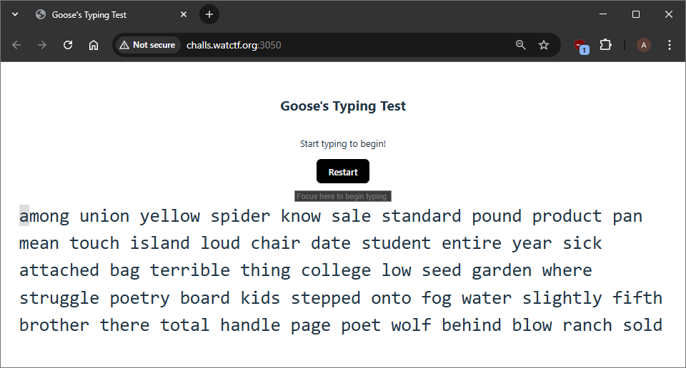
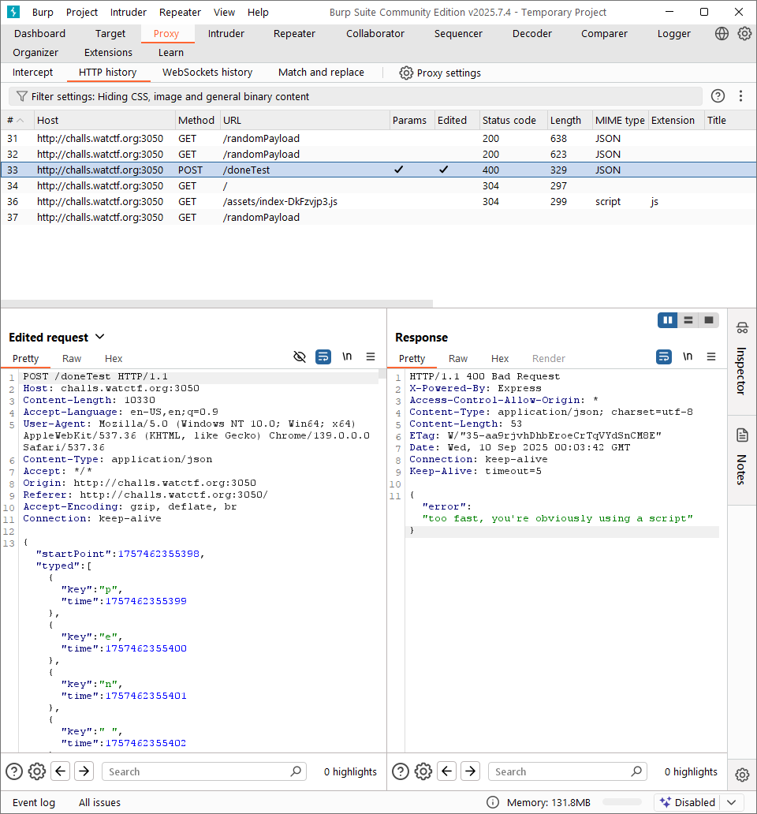
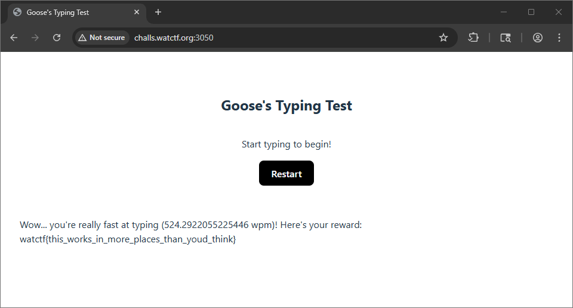

# WatCTF Fall 2025 gooses-typing-test Writeup

Are you a good typer? The Goose challenges you!

http://challs.watctf.org:3050/

## Understanding



Love games!


Just type 500 wpm, no hax required.

## Solution

Let's look at the HTTP response in Burp Suite



I can modify the time in the request to increment by 1

```
POST /doneTest HTTP/1.1
Host: challs.watctf.org:3050
Content-Length: 10330
Accept-Language: en-US,en;q=0.9
User-Agent: Mozilla/5.0 (Windows NT 10.0; Win64; x64) AppleWebKit/537.36 (KHTML, like Gecko) Chrome/139.0.0.0 Safari/537.36
Content-Type: application/json
Accept: */*
Origin: http://challs.watctf.org:3050
Referer: http://challs.watctf.org:3050/
Accept-Encoding: gzip, deflate, br
Connection: keep-alive

{
    "startPoint": 1757462355398,
    "typed": [
        {
            "key": "p",
            "time": 1757462355399
        },
        {
            "key": "e",
            "time": 1757462355400
        },
        {
            "key": "n",
            "time": 1757462355401
        },
        ...
        {
            "key": "e",
            "time": 1757462355709
        }
    ],
    "seed": "0.18882904937100586"
}
```

But this returns `{"error":"too fast, you're obviously using a script"}`

Let's try again targeting the 500 wpm value.

```
POST /doneTest HTTP/1.1
Host: challs.watctf.org:3050
Content-Length: 10164
Accept-Language: en-US,en;q=0.9
User-Agent: Mozilla/5.0 (Windows NT 10.0; Win64; x64) AppleWebKit/537.36 (KHTML, like Gecko) Chrome/139.0.0.0 Safari/537.36
Content-Type: application/json
Accept: */*
Origin: http://challs.watctf.org:3050
Referer: http://challs.watctf.org:3050/
Accept-Encoding: gzip, deflate, br
Connection: keep-alive

{
    "startPoint": 1757462953489,
    "typed": [
        {
            "key": "a",
            "time": 1757462953489
        },
        {
            "key": "r",
            "time": 1757462953603
        },
        ...
                {
            "key": "r",
            "time": 1757463010292
        }
    ],
    "seed": "0.7436913051779883"
}
```

